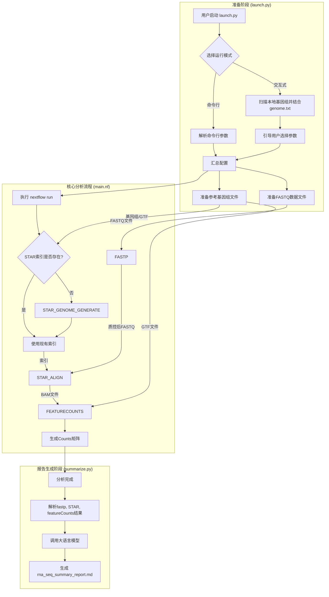

# RNA-Seq 自动化分析与 AI 摘要流程

## 1. 项目概述

本项目是一个全自动的 RNA-Seq 数据分析流程，旨在从原始测序数据（SRR 文件或本地 FASTQ 文件）开始，一直到最终的基因表达定量和一份由大语言模型（LLM）生成的、人类可读的分析报告，实现端到端的自动化处理。

流程通过一个交互式或命令行的启动脚本 (`launch.py`) 来收集参数，然后调用强大的 Nextflow 工作流 (`main.nf`) 来执行核心分析任务。在分析完成后，一个 Python 脚本 (`summarize.py`) 会被自动调用，它将整合质控（fastp）、比对（STAR）和定量（featureCounts）的结果，并利用 LLM 生成一份全面的摘要报告。

整个流程被封装在 Docker 容器中，确保了环境的一致性和可重复性，极大地简化了部署和运行过程。

## 2. 核心功能

- **自动化数据准备**: 自动从 NCBI SRA 下载数据，或使用本地提供的 FASTQ 文件。
- **并行处理**: 高效地并行下载和处理多个样本。
- **智能基因组管理**:
    - **远程下载**: 自动从 `genome.txt` 文件中定义的 URL 下载并管理参考基因组。
    - **本地发现**: 自动扫描 `data/genomes/` 目录，发现并利用本地已存在的基因组。
- **标准化分析流程**: 包含标准的质控 (fastp)、比对 (STAR) 和定量 (featureCounts) 步骤。
- **AI 摘要报告**: 流程结束后，自动调用大语言模型，生成一份包含对质控、比对和定量结果的全面分析与解读的 Markdown 报告。
- **运行时间统计**: 报告中会自动包含流程的开始、结束及总运行时间，方便进行性能评估。
- **Webhook 通知**: 分析完成后，可自动将生成的报告发送到指定的 Webhook URL，方便集成到即时通讯工具（如 Slack, Discord）或自动化工作流中。
- **环境隔离**: 所有依赖项均通过 Docker 和 Conda 进行管理，避免了复杂的本地环境配置。
- **灵活的运行模式**: 支持交互式模式（引导用户完成参数选择）和非交互式模式（通过命令行参数直接运行），方便集成到自动化脚本中。

## 3. 工作流程图

下面的图表展示了从启动到完成的整个工作流程：



## 4. 环境与安装

本流程依赖于 Docker 来保证环境的一致性和可重复性。请确保您的系统中已正确安装并运行 Docker。

### 4.1 构建 Docker 镜像

我们提供了一个 `Dockerfile` 来自动构建包含所有依赖软件（如 Nextflow, SRA-Tools, STAR, Fastp 等）的运行环境。

在项目根目录下，执行以下命令来构建镜像：

```bash
docker build -t ngs-pipeline-with-llm .
```
- `ngs-pipeline-with-llm` 是建议的镜像名称，您可以根据需要修改。

### 4.2 配置 AI 摘要功能

为了让流程能够调用大语言模型，您需要在项目的根目录下创建一个名为 `.env` 的文件。这个文件用于存放您的 API 密钥等敏感信息，**它不会被包含在 Docker 镜像中，保证了安全性**。

文件内容应如下：

```env
# .env
OPENAI_API_KEY="sk-YourActualAPIKey"
OPENAI_API_BASE="https://api.example.com/v1"
OPENAI_MODEL_NAME="your-model-name"
+WEBHOOK_URL=""
```

- **`OPENAI_API_KEY`**: 您的语言模型服务提供商的 API 密钥。
- **`OPENAI_API_BASE`**: 您的语言模型服务的 API 地址。
- **`OPENAI_MODEL_NAME`**: 您希望使用的具体模型名称。
- **`WEBHOOK_URL`**: (可选) 用于接收最终报告的 Webhook URL。如果留空，则不发送通知。

### 4.3 启动容器

构建并配置好 `.env` 文件后，使用以下命令来启动分析流程。

```bash
docker run -it --rm \
  --user=$UID:$(id -g $USER) \
  -v "$(pwd)/.env:/app/.env:ro" \
  -v "$(pwd)/data:/data" \
  -v "$(pwd)/SRR_list.txt:/data/SRR_list.txt" \
  -v "$(pwd)/genome.txt:/data/genome.txt" \
  --name ngs_pipeline_runner \
  ngs-pipeline-with-llm
```

**命令解释:**
- `-it`: 以交互模式运行容器。
- `--rm`: 容器停止后自动删除。
- `--user=$(id -u):$(id -g)`: 使用当前用户的身份来运行容器，避免在 `data` 目录中产生 root 用户拥有的文件。
- **`-v "$(pwd)/.env:/app/.env:ro"`**: **（关键）** 将本地的 `.env` 文件作为**只读卷**挂载到容器的 `/app/.env`。这是最安全、最可靠的传递密钥的方式。
- `-v "$(pwd)/data:/data"`: 将本地的 `data` 目录挂载到容器的 `/data` 目录，用于持久化存储所有输出结果。**首次运行前，请确保本地存在 `data` 目录。**
- `-v "$(pwd)/SRR_list.txt:/data/SRR_list.txt"`: 将本地的 `SRR_list.txt` 文件挂载到容器中。
- `-v "$(pwd)/genome.txt:/data/genome.txt"`: 将本地的 `genome.txt` 配置文件挂载到容器中。

## 5. 使用方法

本流程支持两种运行模式：**交互式模式**和**非交互式（命令行）模式**。

在运行前，建议您先根据需求准备好以下关键文件并放入`/data`目录：
- **`SRR_list.txt`**: 如果您需要从SRA下载数据，请在此文件中每行输入一个SRR ID。
- **`genome.txt`**: 定义可供下载的基因组。格式为 `文件名 类型: URL`，例如：
  ```
  hg38.fa fasta: https://hgdownload.soe.ucsc.edu/goldenPath/hg38/bigZips/hg38.fa.gz
  hg38.gtf gtf: https://hgdownload.soe.ucsc.edu/goldenPath/hg38/bigZips/genes/hg38.ncbiRefSeq.gtf.gz
  ```
- **本地基因组**: 您也可以将基因组文件手动放置在 `data/genomes/<物种>/<版本>/` 目录下，流程会自动发现并优先使用它们。

### 5.1 交互式模式

这是默认的运行模式。当您直接运行 `docker run ...` 命令而不带任何额外参数时，将进入此模式。脚本会通过一系列问题引导您完成配置：

1.  **选择数据源**:
    *   `1`: 从 SRR 列表文件下载数据。您需要提供一个包含 SRR accession numbers 的文件（默认为 `SRR_list.txt`）。
    *   `2`: 使用本地的 FASTQ 文件。脚本会自动在 `data/fastq_files` 目录中查找文件。

2.  **选择测序类型**:
    *   `1`: 单端测序 (Single-End)。
    *   `2`: 双端测序 (Paired-End)。

3.  **选择物种和基因组**:
    *   脚本会首先扫描 `data/genomes` 目录以查找本地可用的基因组，并结合 `genome.txt` 文件中定义的可下载基因组，生成一个完整的选项列表。
    *   您将看到一个带有来源标识（`local` 或 `remote`）的菜单，方便您选择。
    *   如果选择 `local` 基因组，流程将跳过下载步骤。

配置完成后，脚本会显示一个配置摘要供您确认。确认后，流程将自动开始。

### 5.2 非交互式（命令行）模式

通过在 `docker run` 命令的末尾附加参数，可以跳过交互式问答，直接运行。

**示例:**
```bash
docker run -it --rm \
  --user=$UID:$(id -g $USER) \
  -v "$(pwd)/.env:/app/.env:ro" \
  -v "$(pwd)/data:/data" \
  -v "$(pwd)/SRR_list.txt:/data/SRR_list.txt" \
  -v "$(pwd)/genome.txt:/data/genome.txt" \
  --name ngs_pipeline_runner \
  ngs-pipeline-with-llm \
  --srr_list /data/SRR_list.txt \
  --species mouse \
  --genome_version mm39
```

**可用参数:**

| 参数 | 类型 | 描述 | 是否必须 |
| :--- | :--- | :--- | :--- |
| `--srr_list` | string | 指向 SRR 列表文件的路径。与 `--fastq_dir` 二选一。 | 是 |
| `--fastq_dir` | string | 指向包含本地 FASTQ 文件的目录路径。与 `--srr_list` 二选一。 | 是 |
| `--seq_mode` | flag | 如果提供此参数，则代表单端测序。默认为双端。 | 否 |
| `--species` | string | 物种名称（如 `human`, `mouse`）。必须在 `genome.txt` 中有定义或在本地 `data/genomes` 中存在。 | 是 |
| `--genome_version` | string | 基因组版本（如 `hg38`, `mm39`）。必须在 `genome.txt` 中有定义或在本地 `data/genomes` 中存在。 | 是 |

**注意**: 在非交互式模式下，`--srr_list` 和 `--fastq_dir` 必须提供一个，且只能提供一个。

## 6. 工作流详解

核心分析流程由 `main.nf` 文件定义，它编排了以下几个关键的生物信息学分析步骤：

### 6.1 `STAR_GENOME_GENERATE`
- **功能**: 构建 STAR 比对所需的基因组索引。
- **触发条件**: 仅当在 `data/genomes/<species>/<version>/` 目录下未找到 `star_index` 文件夹时，此步骤才会运行。
- **输入**: 参考基因组 FASTA 文件和基因注释 GTF 文件。
- **输出**: 一个名为 `star_index` 的目录，包含所有索引文件。
- **环境**: `align_env` (包含 STAR)。

### 6.2 `FASTP`
- **功能**: 对原始的 FASTQ 文件进行质量控制和过滤。它会去除低质量的 reads、接头序列等。
- **输入**: 每个样本的 FASTQ 文件（单端或双端）。
- **输出**:
    - 过滤后的 FASTQ 文件 (`_trimmed_*.fastq.gz`)。
    - HTML 格式的质控报告。
    - JSON 格式的质控报告。
- **环境**: `qc_env` (包含 fastp)。

### 6.3 `STAR_ALIGN`
- **功能**: 将经过质控的 reads 比对到参考基因组。
- **输入**:
    - 过滤后的 FASTQ 文件。
    - STAR 基因组索引。
- **输出**:
    - BAM 格式的比对文件 (`.bam`)，已按坐标排序。
    - STAR 运行日志 (`.log`)。
- **环境**: `align_env` (包含 STAR)。

### 6.4 `FEATURECOUNTS`
- **功能**: 对所有样本的比对结果（BAM 文件）进行基因表达水平的定量。
- **输入**:
    - 所有样本的 BAM 文件。
    - 基因注释 GTF 文件。
- **输出**:
    - `counts.txt`: 原始 read counts 矩阵。
    - `counts.txt.summary`: 定量过程的统计摘要。
- **环境**: `quant_env` (包含 subread/featureCounts)。

### 6.5 `summarize.py` (AI 摘要生成)
- **功能**: 在 Nextflow 工作流成功执行后，此脚本被自动调用，负责生成最终的 AI 分析报告。
- **触发条件**: `launch.py` 在 `subprocess.run` 成功执行 Nextflow 后调用此脚本。
- **输入**:
    - `fastp` 生成的 JSON 报告。
    - `STAR` 生成的比对日志 (`.log`)。
    - `featureCounts` 生成的定量摘要 (`.summary`)。
- **核心操作**:
    1.  从挂载的 `/app/.env` 文件中加载 `OPENAI_API_KEY` 等配置。
    2.  解析上述输入文件，提取关键统计数据。
    3.  将提取的数据整合成一个详细的 Prompt。
    4.  调用指定的大语言模型（LLM）。
- **输出**: `rna_seq_summary_report.md` 文件，包含流程运行时间统计和对整个流程结果的全面分析和解读。
- **环境**: `ngs_env` (包含 `python-dotenv`, `langchain`, `langchain-openai`)。

## 7. 输出文件结构

所有分析结果都将保存在 `data/` 文件夹中。

```
data/
├── rna_seq_summary_report.md  # 最终生成的 AI 摘要报告
├── srr_files/
│   └── <SRR_ID>/
│       └── <SRR_ID>.sra
├── fastq_files/
│   ├── <SRR_ID>_1.fastq.gz
│   └── <SRR_ID>_2.fastq.gz
├── fastp/
│   └── <SAMPLE_ID>/
│       ├── <SAMPLE_ID>.html
│       └── <SAMPLE_ID>.json
├── bam/
│   └── <SAMPLE_ID>/
│       ├── <SAMPLE_ID>.bam
│       └── <SAMPLE_ID>.log      # STAR 比对日志
├── featurecounts/
│   ├── counts.txt
│   └── counts.txt.summary
└── genomes/
    └── <SPECIES>/
        └── <VERSION>/
            ├── <genome>.fa
            ├── <genome>.gtf
            └── star_index/
