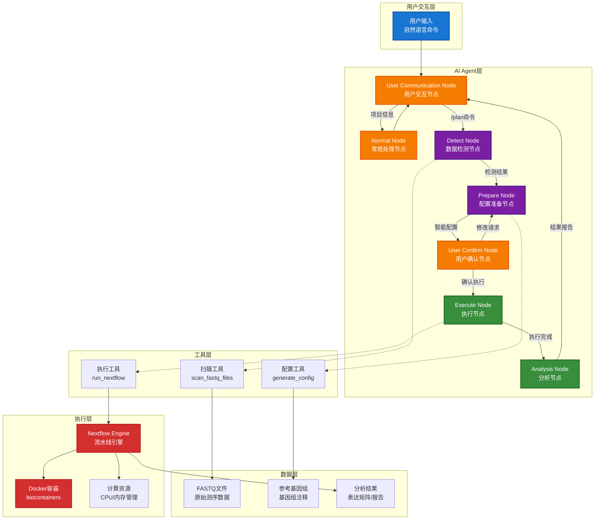
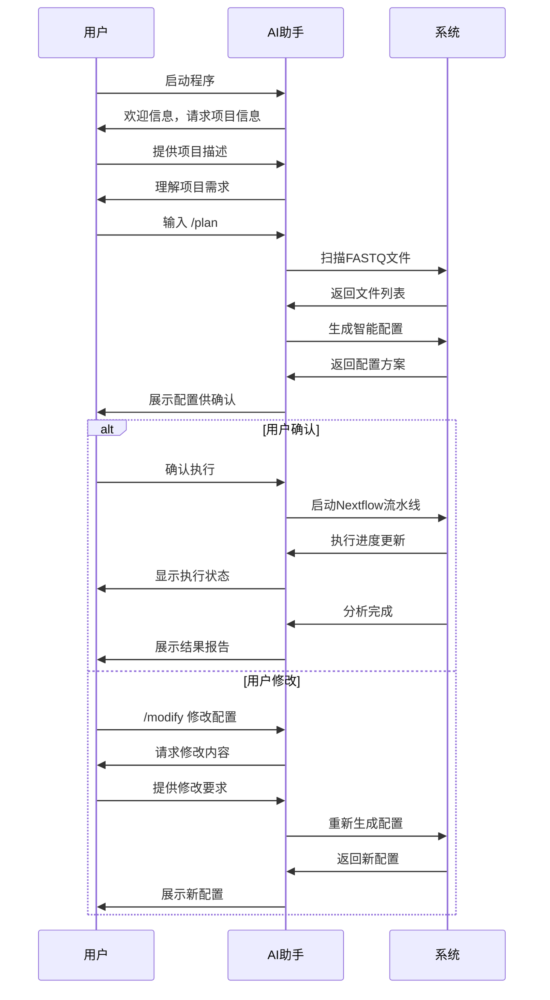

# RNA-seq 智能分析助手

[](https://www.python.org/downloads/)
[](https://www.docker.com/)
[](https://www.nextflow.io/)

## 📖 项目简介

RNA-seq智能分析助手是一个基于AI Agent架构的生物信息学分析工具，通过自然语言交互界面自动生成和执行Nextflow流水线，专注于本地RNA-seq数据处理的智能化、标准化和容器化。

### 核心特性

- 🤖 **自然语言交互**: 通过对话式界面配置和执行RNA-seq分析
- 🧬 **智能配置生成**: AI自动推荐最优分析参数和资源配置
- 🐳 **完全容器化**: Docker集成，确保环境一致性和可重现性
- 🔄 **标准化流程**: 基于Nextflow DSL2的标准化分析流水线
- 📊 **多物种支持**: 预配置8种常用模式生物基因组
- ⚡ **智能资源管理**: 自动选择合适工具(STAR/HISAT2)并优化资源分配

## 🏗️ 系统架构



## 🚀 快速开始

### 环境要求

- Docker 20.10+
- 至少 16GB RAM (推荐32GB用于STAR比对)
- 100GB+ 可用磁盘空间
- Linux/macOS/WSL2

> 注：Python、Nextflow等依赖已包含在Docker镜像中，无需单独安装

### Docker部署

```bash
# 克隆项目
git clone https://github.com/Sparrowsta/rnaseq-workflow.git
cd ngs

# 设置API密钥
echo "DEEPSEEK_API_KEY=your-api-key-here" > .env

# 构建Docker镜像
docker build -t ngs-agent .

# 运行容器
docker run -it --rm \
  --env-file .env \
  -v $(pwd)/data:/data \
  -v $(pwd)/config:/config \
  -u $(id -u):$(id -g) \
  ngs-agent
```


## 📚 使用指南

### 基本工作流程



### 工作模式

#### 🔍 Normal模式 (默认)
项目信息查询和管理中心，支持自然语言交互：

```bash
# 查询项目状态
用户: 项目概览

# 扫描FASTQ文件
用户: 扫描FASTQ文件

# 查看基因组信息
用户: 显示可用的基因组

# 添加基因组
用户：添加基因组 [fasta url] [gtf_url]

# 查看分析历史
用户: 查看之前的分析结果

# 预设分析参数
用户: 使用mm10基因组
用户: 使用单端测序模式

```

#### 🚀 Plan模式 (分析流水线)
智能分析规划和执行模式：

```bash
# 进入分析规划模式
用户: /plan

# 系统自动执行7个并行检测任务：
# 1. 分析FASTQ文件结构和样本配对
# 2. 验证基因组文件完整性
# 3. 评估系统资源(CPU/内存/磁盘)
# 4. 检测fastp工具可用性
# 5. 检测STAR工具可用性
# 6. 检测HISAT2工具可用性
# 7. 检测featureCounts工具可用性

# 确认或修改配置
用户: /execute  # 确认执行
用户: /modify   # 修改配置
```

### 命令说明

| 命令 | 功能 | 使用场景 |
|------|------|----------|
| `/plan` | 启动分析规划 | 完成项目描述后，开始数据检测和配置生成 |
| `/modify` | 修改配置 | 在配置确认阶段，对生成的配置进行调整 |
| `/execute` | 执行分析 | 确认配置后，启动Nextflow流水线 |
| `/help` | 获取帮助 | 查看可用命令和使用说明 |
| `/exit` | 退出程序 | 结束会话 |

### 使用示例

```bash
# 1. 启动Docker容器
$ docker run -it --rm \
  --env-file .env \
  -v $(pwd)/data:/data \
  -v $(pwd)/config:/config \
  -v /etc/localtime:/etc/localtime:ro \
  -v /etc/timezone:/etc/timezone:ro \
  -u $(id -u):$(id -g) \
  ngs-agent

🚀 初始化RNA-seq智能分析助手...
✅ 环境类型: 容器环境
✅ 配置目录: /config
✅ 数据目录: /data
✅ 基因组配置文件存在: /config/genomes.json
🔗 验证DeepSeek LLM连接...
✅ DeepSeek LLM连接成功
⚙️ 创建LangGraph Agent...
✅ Agent创建成功

============================================================
🔬 RNA-seq智能分析助手 - 本地FASTQ数据分析工具
============================================================

📋 **快速开始:**
   /plan                   - 🚀 开始RNA-seq分析流程
   /plan 使用hg19基因组    - 🎯 指定分析需求开始

📊 **项目管理:**
   项目概览                - 📈 查看项目整体状态
   FASTQ文件查询           - 📂 浏览可用的测序数据
   基因组信息查询          - 🧬 检查基因组配置状态

💡 **使用提示:**
   • 支持中文自然语言交互，直接描述您的分析需求
   • 系统会自动检测FASTQ文件并智能配对
============================================================

# 2. 开始分析规划（带参数）
请输入: /plan 使用特定前缀的样本 使用果蝇基因组

🚀 进入检测流程
🔎 正在执行全面环境与数据检测...
🔍 FASTQ扫描: files=13 samples=10
✅ 检测完成: FASTQ样本: 10 | 可用基因组: 4 | 工具: fastp:✅, star:✅, hisat2:✅, featurecounts:✅

⚙️ 开始智能配置分析...
✅ 配置生成完成

============================================================
🎯 **分析配置确认**
============================================================

📋 **配置摘要:**
   🎯 比对工具: star
   🧹 质控工具: fastp
   📊 定量工具: featurecounts
   🧬 基因组版本: dm6 (果蝇)
   🔄 测序类型: 单端测序
   📂 样本文件: 3个样本
      1. Sample_001
      2. Sample_002
      3. Sample_003

🖥️ **资源配置:**
   ⚙️ fastp: 4核, 8 GB
   ⚙️ star_align: 8核, 32 GB
   ⚙️ featurecounts: 4核, 8 GB

💭 **配置理由:**
   选择STAR因为系统有充足内存；dm6基因组已存在且索引已构建；
   仅处理指定前缀的样本，忽略其他样本

🔄 **请选择下一步操作:**
   /execute         - 🚀 执行分析
   /modify [需求]   - 🔧 修改配置
   /cancel          - ❌ 取消分析
============================================================

# 3. 执行分析
请输入命令: /execute

🚀 **RNA-seq分析执行**
📁 报告目录: /data/reports/YYYYMMDD_HHMMSS
✅ Nextflow配置文件已生成
✅ 运行时配置已保存

⚡ **执行Nextflow流水线...**
🕐 开始时间: YYYY-MM-DD HH:MM:SS
🚀 启动Nextflow执行...

[HH:MM:SS] executor >  local (9)
[HH:MM:SS] [xx/xxxxxx] process > download_genome      [100%] 1 of 1, cached: 1 ✔
[HH:MM:SS] [xx/xxxxxx] process > fastp (3)            [100%] 3 of 3, cached: 3 ✔
[HH:MM:SS] [xx/xxxxxx] process > star_align (3)       [100%] 3 of 3 ✔
[HH:MM:SS] [xx/xxxxxx] process > featurecounts        [100%] 1 of 1 ✔
[HH:MM:SS] [xx/xxxxxx] process > multiqc              [100%] 1 of 1 ✔

✅ 分析完成！

📊 **分析总结:**
• 总运行时间: X分Y秒
• 样本数量: 3个
• 平均比对率: XX.X%

📁 **结果位置:**
• 质控报告: results/{qc_tool}/{sample_id}/*.html
• 表达矩阵: results/{quant_tool}/all_samples.counts.txt
• 比对文件: results/bam/{sample_id}/*.bam
```

## 🧬 支持的物种

| 物种 | 基因组版本 | 参考来源 |
|------|-----------|----------|
| 人类 | hg38, hg19 | UCSC |
| 小鼠 | mm39, mm10, mm9 | UCSC |
| 斑马鱼 | danRer11 | UCSC |
| 果蝇 | dm6 | UCSC |

### 分析工具

| 步骤 | 主要工具 | 备选工具 | 内存需求 |
|------|----------|----------|----------|
| 质控 | fastp | - | 2GB |
| 比对 | STAR | HISAT2 | 32GB / 8GB |
| 定量 | featureCounts | - | 4GB |

## 🔧 高级配置

### 自定义基因组

直接编辑 `config/genomes.json` 文件添加或修改基因组配置：

```json
{
  "mm10": {
    "name": "Mouse mm10",
    "fasta_url": "https://hgdownload.soe.ucsc.edu/goldenPath/mm10/bigZips/mm10.fa.gz",
    "gtf_url": "https://ftp.ebi.ac.uk/pub/databases/gencode/Gencode_mouse/release_M25/gencode.vM25.annotation.gtf.gz",
    "star_index": "/data/genomes/mm10/star_index/",
    "hisat2_index": "/data/genomes/mm10/hisat2_index/mm10"
  },
  "custom_genome": {
    "name": "Custom Species",
    "fasta_url": "https://example.com/genome.fa.gz",
    "gtf_url": "https://example.com/annotation.gtf.gz",
    "star_index": "/data/genomes/custom/star_index/",
    "hisat2_index": "/data/genomes/custom/hisat2_index/custom"
  }
}
```

修改后系统会自动识别新的基因组配置，无需重启容器。

## 📊 输出结果

分析完成后，结果将保存在 `results/` 目录：

```
results/
├── {qc_tool}/             # 质控结果 (如fastp)
│   └── {sample_id}/      # 每个样本的质控报告
├── bam/                   # 比对结果
│   └── {sample_id}/      # 每个样本的BAM文件
├── {quant_tool}/          # 定量结果 (如featurecounts)
│   └── all_samples.counts.txt # 所有样本的计数矩阵
└── logs/                   # 运行日志
```

## 🤝 贡献指南

欢迎贡献代码、报告问题或提出建议！

## 🙏 致谢

- [Nextflow](https://www.nextflow.io/) - 流水线框架
- [LangGraph](https://github.com/langchain-ai/langgraph) - Agent框架
- [DeepSeek](https://www.deepseek.com/) - LLM服务
- [Biocontainers](https://biocontainers.pro/) - 生物信息学容器
- [fastp](https://github.com/OpenGene/fastp) - 质控工具
- [STAR](https://github.com/alexdobin/STAR) - 比对工具
- [HISAT2](http://daehwankimlab.github.io/hisat2/) - 比对工具
- [featureCounts](http://subread.sourceforge.net/) - 定量工具

---

**⭐ 如果这个项目对您有帮助，请给个Star支持一下！**