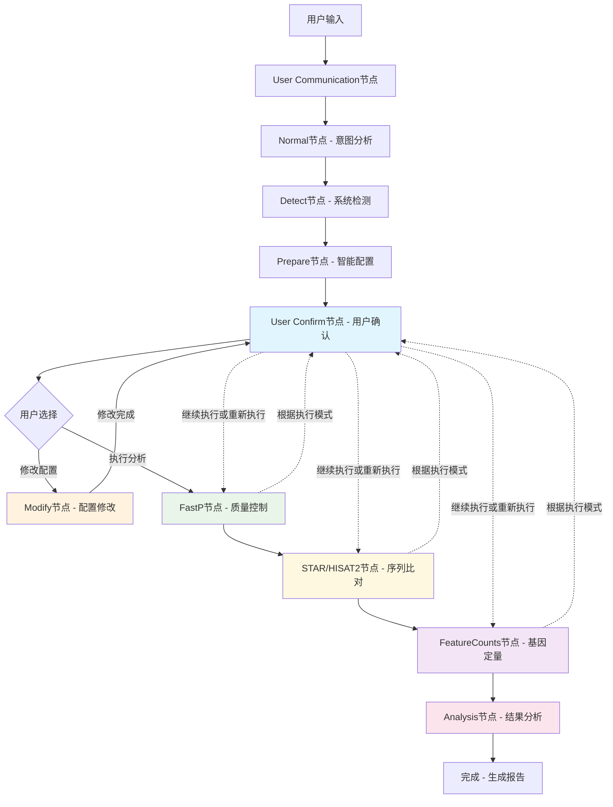

# RNA-seq agent 🧬

**基于AI Agent架构的生信分析工具 - 完整RNA-seq流水线实现**

[](https://www.docker.com/)
[](https://python.org/)
[](https://www.nextflow.io/)
[](https://langchain-ai.github.io/langgraph/)

> 基于AI Agent架构的生信分析工具，通过自然语言界面自动生成和执行Nextflow流水线，专注于本地RNA-seq数据处理的智能化、标准化和容器化。系统采用LangGraph状态图架构，支持双比对器（STAR/HISAT2）选择，实现端到端的RNA-seq数据分析流程。

## 🌟 项目特色

- 🎯 **双比对器架构**: 支持STAR和HISAT2两种主流比对算法
- 🧠 **AI智能配置**: DeepSeek驱动的参数优化和自然语言配置
- 🔧 **11节点LangGraph**: 完整状态图设计，支持智能路由决策
- 🚀 **容器化流水线**: 基于Nextflow DSL2和Docker的可重现分析环境
- 🔄 **四种执行模式**: 从单步确认到全自动YOLO模式
- ✨ **中文界面**: 完整的中文自然语言交互界面

## 🏗️ 系统架构

### 核心工作流程



## 🚀 快速开始

### 环境配置

1. **准备API密钥**
```bash
# 配置DeepSeek API密钥
echo "DEEPSEEK_API_KEY=your-api-key-here" > .env
```

2. **准备数据目录**
```bash
mkdir -p data/{fastq}
# 将FASTQ文件放入 data/fastq/
```

### Docker部署（推荐）

```bash
# 构建镜像
docker build -t ngs-agents .

# 运行分析
docker run --rm \
  --env-file .env \
  -v $(pwd)/data:/data \
  -u $(id -u):$(id -g) \
  ngs-agents
```

## 📖 使用指南

### 📁 基因组配置

系统通过`data/config/genomes.json`管理基因组配置，支持多物种基因组。

#### 预设基因组支持
系统已预配置以下基因组（含完整URL链接）：
- **人类**: hg38, hg19
- **小鼠**: mm39, mm10, mm9
- **非洲爪蟾**: xenLae2
- **斑马鱼**: danRer11
- **果蝇**: dm6

#### 配置方式
1. **主菜单选择**: 选择 `3) 基因组配置（仅添加）`
2. **自然语言描述**: 需提供基因组ID、物种、FASTA和GTF的URL链接
3. **自动管理**: 系统自动下载文件并构建索引

#### 目录结构
```
data/genomes/
├── human/hg38/          # 人类基因组
├── mouse/mm39/          # 小鼠基因组
└── drosophila/dm6/      # 果蝇基因组
```

### 主界面操作

当启动应用后，您将看到主菜单界面：

```
🔬 RNA‑seq 智能分析助手
━━━━━━━━━━━━━━━━━━━━━━━━━━━━━━━━━━━━━━━━━━━━━━━━━━━━━━━━━━
📋 请选择操作
  1) 执行分析
  2) 项目概览
  3) 基因组配置（仅添加）
  4) 退出

💡 使用提示:
  • 数字选择：输入对应数字进行操作
  • 自由查询：直接输入问题进行智能分析
  • 支持中文自然语言交互
  • 基于Docker容器化，工作目录=/data，支持相对路径
```

#### 操作说明：

1. **执行分析** - 进入RNA-seq分析流水线，支持智能配置和四种执行模式
2. **项目概览** - 查看项目状态、数据文件、工具版本等信息
3. **基因组配置** - 添加新的基因组参考文件和注释
4. **自然语言查询** - 直接输入问题，如"帮我分析这些FASTQ文件"

### User Confirm界面详解

在分析过程中，系统会进入确认界面，展示智能生成的配置参数：

#### 确认界面功能

1. **查看配置** - 展示所有工具的参数配置和资源分配
2. **执行模式选择** - 选择四种执行模式之一
3. **参数修改** - 使用自然语言修改特定参数
4. **执行分析** - 确认配置后开始执行
5. **取消操作** - 返回主菜单

#### 确认界面操作说明

用户确认界面采用**纯数字选择**方式，根据执行进度动态显示不同的操作选项：

**初始状态（无执行进度）**：
```
🔄 请选择下一步操作:
    1) 执行分析（支持选择执行模式） ⚡
    2) YOLO 自动执行 🎯
    3) 修改配置 🔧
    4) 取消分析 ❌
    5) 退出程序 🚪
```

**操作说明**：
- **数字选择**：输入对应数字执行操作
- **执行分析**：可选择Single/Optimized/Batch Optimize三种模式
- **YOLO模式**：全自动执行，无中间确认
- **继续执行**：根据当前进度继续到下一步骤
- **修改配置**：支持自然语言修改参数

**执行中状态（有执行进度）**：
```
🔄 请选择下一步操作:
    1) 继续到下一步骤 ➡️
    2) 重新开始完整流水线 🔄
    3) 重新优化当前步骤 ♻️
    4) 修改配置 🔧
    5) 取消分析 ❌
    6) 退出程序 🚪
```

**操作说明（执行中状态）**：
- **继续到下一步骤**：根据当前完成的步骤自动进入下一阶段
- **重新开始完整流水线**：清空当前进度，从FastP质控重新开始
- **重新优化当前步骤**：应用当前的参数生成再次执行该步骤,并再次产生优化参数建议
- **修改配置**：使用自然语言调整任意工具的参数设置
- **取消分析**：停止当前分析，返回主菜单
- **退出程序**：完全退出RNA-seq分析助手

#### 自然语言修改示例

- `"将FastP的质量过滤阈值改为25"`
- `"使用HISAT2而不是STAR进行比对"`
- `"增加FeatureCounts的线程数到12"`
- `"修改内存分配，给STAR分配32GB"`

## 🎯 四种执行模式

系统支持四种不同的执行模式，满足不同使用场景：

### 1. Single Mode（单步模式）
- **特点**: 成功时自动继续，失败时返回确认
- **适用**: 一般使用场景，平衡效率与控制
- **路由逻辑**: 成功→自动前进，失败→用户确认
- **流程**: FastP → STAR/HISAT2 → FeatureCounts → Analysis（成功时连续执行）

### 2. Optimized Mode（AI优化模式）
- **特点**: **每步成功后都返回确认界面**，展示LLM生成的智能优化建议
- **适用**: 需要每步AI优化参数的精细分析
- **路由逻辑**: 无论成功失败都返回确认，展示DeepSeek LLM优化建议
- **流程**: FastP → 确认(AI优化) → STAR/HISAT2 → 确认(AI优化) → FeatureCounts → 确认(AI优化) → Analysis

### 3. Batch Optimize Mode（AI批量优化模式）
- **特点**: 前面步骤自动执行，**仅在FeatureCounts后展示LLM综合优化分析**
- **适用**: 减少交互，在关键节点进行AI驱动的参数优化
- **路由逻辑**: FastP/比对成功→自动前进，FeatureCounts成功→LLM优化分析确认
- **流程**: FastP → STAR/HISAT2 → FeatureCounts → 确认(AI综合优化并返回Fastp) → Analysis

### 4. YOLO Mode（AI极速模式）
- **特点**: **全程LLM自动优化执行，成功时从不人工确认**
- **适用**: 可信数据、AI驱动的快速批量处理
- **路由逻辑**: 成功→LLM自动优化前进，失败→用户确认（与Single相同）
- **流程**: FastP → STAR/HISAT2 → FeatureCounts → Analysis（AI完全自动化优化）

## 🔧 AI智能优化建议机制（实验性功能）

系统使用**DeepSeek LLM驱动的智能参数优化引擎**，在每个分析步骤完成后，自动分析执行结果并提供个性化的参数优化建议。

> ⚠️ **注意**: 此为实验性AI优化功能，建议结合实际项目需求和专业知识谨慎采纳。

### 优化建议的触发条件

- **Optimized Mode**: 每步执行成功后都返回确认界面，展示LLM生成的优化建议
- **Batch Optimize Mode**: 在FeatureCounts执行完成后提供综合优化建议
- **yolo**: 全自动执行,每步优化都交由LLM执行

### LLM驱动的优化建议示例

#### FastP节点AI优化
```bash
🤖 DeepSeek LLM 智能优化建议：
📊 FastP 参数优化：
• 质量过滤阈值: 20 → 25 (基于数据质量分布)
• 长度过滤: 75 → 50 (适配短读长数据)
• 线程数: 4 → 8 (匹配可用CPU资源)

🔍 AI分析理由：
- 输入数据Q30比例达98.5%，可适当提高质量阈值
- 检测到短读长样本，调整最小长度过滤
- 系统有充足CPU资源，增加并行度提升速度
```

#### STAR节点AI优化
```bash
🤖 DeepSeek LLM 智能优化建议：
📊 STAR 参数优化：
• 内存限制: 30GB → 16GB (基于基因组大小)
• splice junction: 1000 → 10 (提高新剪接位点检测)
• 多重比对: 10 → 1 (提升唯一比对率)

🔍 AI分析理由：
- 人类基因组实际需要约14GB内存，降低资源占用
- FastP结果显示高质量数据，可检测更多剪接位点
- 样本类型适合严格唯一比对策略
```

## 🛠️ 支持的生信工具

- **FastP**: 高效FASTQ质量控制和预处理
- **STAR**: 高精度RNA-seq序列比对器
- **HISAT2**: 快速大基因组RNA-seq比对器  
- **FeatureCounts**: 基因表达水平定量工具
- **Nextflow**: 工作流管理和容器化执行

### 核心设计原则

1. **统一LLM配置**: 使用`get_shared_llm()`获取共享实例
2. **容器优先设计**: 所有路径和配置适配容器环境  
3. **完整错误处理**: 所有工具函数包含异常处理逻辑
4. **中文用户界面**: 用户交互和错误信息使用中文
5. **模块化工具集**: 高度解耦的工具模块设计

## 🤝 贡献指南

欢迎贡献代码、报告问题或提出改进建议！

## 🙏 致谢

- [LangGraph](https://langchain-ai.github.io/langgraph/) - 强大的AI Agent状态图框架
- [Nextflow](https://www.nextflow.io/) - 优秀的科学计算工作流引擎
- [DeepSeek](https://www.deepseek.com/) - 高质量的大语言模型服务
- 生信社区的开源工具和最佳实践

---