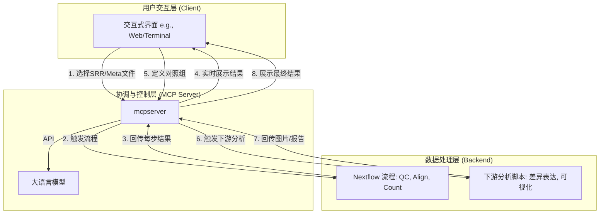
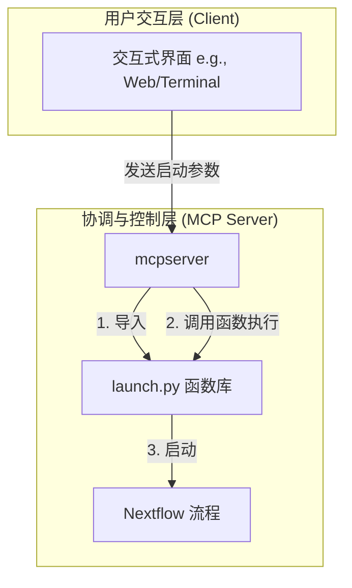

# LLM 驱动的交互式生物信息分析平台开发计划

## 1. 项目总体架构设计

这是一个由大语言模型（LLM）驱动的、高度互动的、端到端的生物信息分析平台。`mcpserver` 是这个平台的核心中枢，负责协调前端交互、后端计算和结果展示。

---

## 2. 详细开发任务清单 (ToDo List) - 修订版

**核心架构思想：`mcpserver` 作为流程的唯一主控制器，导入并调用 `launch.py` 提供的函数库来完成具体的执行步骤。**

### 阶段一：MCP Server 核心框架与 `launch.py` 改造
- [ ] **1.1** **重构 `launch.py`**：将其从一个可执行脚本重构为一个可被导入的 Python 模块。剥离其 `main` 函数和命令行参数解析逻辑，暴露出一系列清晰的、可供外部调用的函数（如 `setup_directories`, `prepare_fastq_files`, `prepare_genome_files`, `run_nextflow` 等）。
- [ ] **1.2** **增强 `mcpserver` 的任务模型**：修改 `server.py` 中的 Pydantic 模型，使其能接收启动 Nextflow 所需的全部参数（如 `srr_list`, `seq_mode`, `species`, `genome_version` 等）。
- [ ] **1.3** **实现异步任务执行**：在 `mcpserver` 中，使用 FastAPI 的 `BackgroundTasks` 或其他异步执行机制。当 API 被调用时，在后台线程中执行耗时的 `launch.py` 函数调用，避免阻塞服务器。
- [ ] **1.4** **创建主控制端点 `/run_pipeline`**：在 `server.py` 中创建一个新的 API 端点。此端点将：
    - 接收所有必要的参数。
    - 创建一个任务 ID。
    - 在后台任务中，按顺序调用从 `launch.py` 导入的函数来执行完整的上游分析流程。

### 阶段二：Nextflow 流程与 MCP Server 的双向通信
- [ ] **2.1** 修改 `main.nf` (Nextflow 脚本)，在 `fastp`, `STAR`, `featureCounts` 等关键流程执行完毕后，增加一个调用 MCP Server API 的步骤（例如 `POST /tasks/{task_id}/results`），将该步骤的总结结果回传。
- [ ] **2.2** 在 MCP Server 端，完善用于接收和处理来自 Nextflow 分步结果的端点。
- [ ] **2.3** 实现结果的持久化存储，确保上游生成的总结报告与对应的 `task_id` 关联并被保留。
- [ ] **2.4** (可选) 实现一个简易的客户端脚本 `mcp_client.py`，用于替代 `launch.py` 的原有功能，直接与 `/run_pipeline` 端点交互，方便测试。

### 阶段三：交互式前端与实时反馈
- [ ] **3.1** 设计一个简易的前端界面（或增强现有的终端交互），用于展示从 MCP Server 获取的数据。
- [ ] **3.2** 实现前端轮询或使用 WebSocket 从 MCP Server 获取实时任务状态和分步 QC 结果。
- [ ] **3.3** 在前端界面上清晰地展示每个样本的 QC、比对和计数总结。

### 阶段四：下游差异分析的交互式设计
- [ ] **4.1** 在 MCP Server 中实现一个用于上传和解析 `meta` 数据文件的 API 端点。
- [ ] **4.2** 在前端界面上，根据 `meta` 文件内容，动态展示所有样本信息。
- [ ] **4.3** 创建一个允许用户通过点选来定义“对照组”和“实验组”的交互功能。
- [ ] **4.4** 将用户定义的分组信息通过 API 发送并存储在 MCP Server 中。

### 阶段五：下游分析与结果回传
- [ ] **5.1** 编写一个新的下游分析脚本（例如 `differential_analysis.py`），该脚本由 MCP Server 触发。
- [ ] **5.2** 该脚本接收基因表达矩阵、meta 文件和用户定义的分组信息作为输入。
- [ ] **5.3** 使用 R 语言的 `DESeq2` 或 `edgeR` 包（可通过 `rpy2` 或 `subprocess` 调用）进行差异表达分析。
- [ ] **5.4** 生成火山图、热图等可视化结果，并保存为图片文件。
- [ ] **5.5** 脚本执行完毕后，将生成的图片文件路径或内容回传给 MCP Server。

### 阶段六：最终结果展示与整合
- [ ] **6.1** 在 MCP Server 中创建用于提供分析结果图片或报告的 API 端点。
- [ ] **6.2** 在前端界面上，实现对差异分析结果（如火山图、数据表格）的展示。
- [ ] **6.3** (可选) 整合 LLM，对最终的差异分析结果进行自动解读和总结。